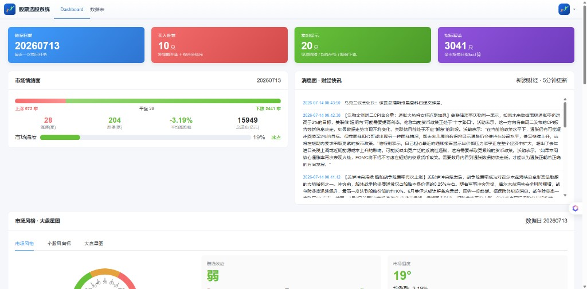
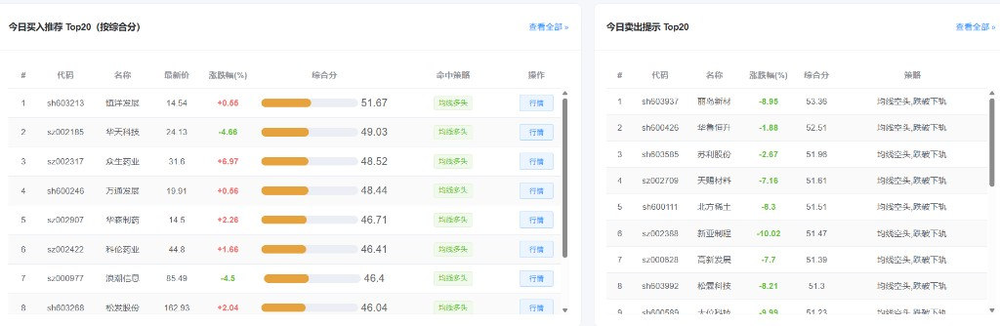
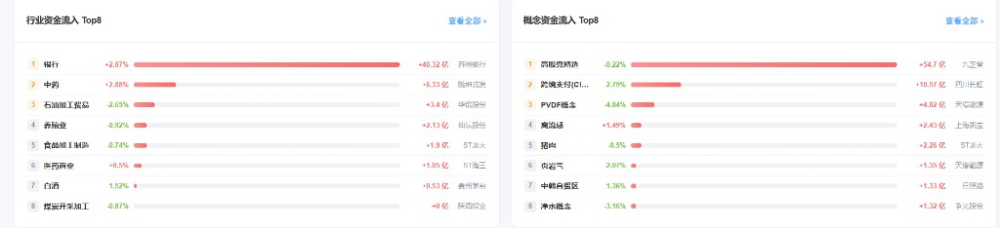
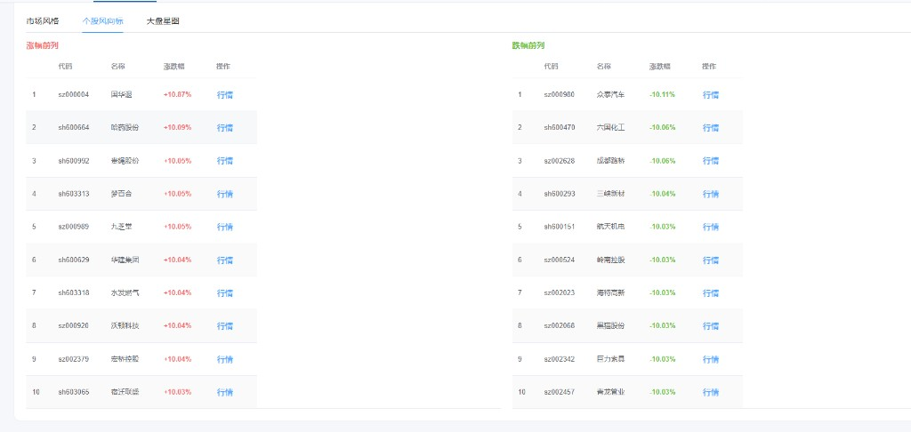
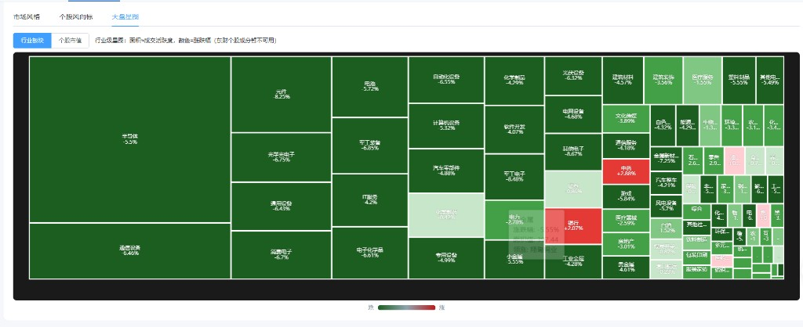

# 股票选股系统

A 股日更选股与市场观察台：盘后自动算指标、产出买卖 Top 推荐，并在 Dashboard 上展示情绪、资金流、大盘星图等。

基于 [pythonstock/stock](https://github.com/pythonstock/stock) 二次开发。

---

## 功能一览

| 模块 | 说明 |
|------|------|
| 每日流水线 | 行情 → 指标 → 基本面补全 → 买入/卖出筛选 → 龙虎榜/板块资金 → 健康监控 |
| 买入推荐 | KDJ 强势 / 均线多头，综合打分；结合市场温度与龙虎榜加分，默认 Top20（极冷市 Top10） |
| 卖出提示 | 见顶回落 / 均线空头 / 跌破布林下轨，多策略加分后取 Top20 |
| 市场情绪 | 涨跌家数、涨跌停、成交额、市场温度 |
| 市场风格 | 建议仓位、赚钱效应、板块资金瓷砖 |
| 个股风向标 | 当日涨幅 / 跌幅前列 |
| 大盘星图 | 行业热力树图 + 个股市值热力 |
| 数据表 | 按日期 / 代码 / 名称查询，龙虎榜席位过滤 |

---

## 界面预览

### Dashboard 总览

情绪面、快讯、市场风格入口与当日任务摘要。



### 买入 / 卖出推荐

按综合分排序的 Top20，可跳转东财行情。



### 行业 / 概念资金流

净流入 Top8，红涨绿跌（A 股习惯配色）。



### 个股风向标

涨幅前列 / 跌幅前列对照。



### 大盘星图

行业板块树图：面积 ≈ 成交活跃度，颜色 = 涨跌幅；可切换「个股市值」视图。



---

## 技术栈

- **后端**：Python 3 + Tornado + MySQL + AkShare + pandas / stockstats  
- **前端**：Vue 2 + Element UI + ECharts  
- **日更**：Windows 可用 `backend/jobs/run_daily.ps1`（也可配合任务计划约 18:00 执行）

---

## 快速开始

### 1. 数据库

准备 MySQL 库 `stock_data`，可用 `docker-compose/` 初始化，或自行导入 `docker-compose/mysql/init.sql`。

连接通过环境变量配置（**不要把密码写进仓库**）：

```powershell
$env:MYSQL_HOST = "localhost"
$env:MYSQL_PORT = "3306"
$env:MYSQL_USER = "root"
$env:MYSQL_PWD  = "你的密码"
$env:MYSQL_DB   = "stock_data"
```

### 2. 后端

```powershell
cd backend
$env:PYTHONPATH = (Get-Location).Path
python web\main.py
```

默认监听 **9090**。

### 3. 前端

```powershell
cd frontend
npm install
# 若 Node 较新出现 OpenSSL 报错：
$env:NODE_OPTIONS = "--openssl-legacy-provider"
npm run dev
```

浏览器打开 **http://localhost:8080**。

### 4. 跑一日数据（可选）

```powershell
cd backend\jobs
$env:MYSQL_PWD = "你的密码"
.\run_daily.ps1
```

日志在 `backend/logs/`。

---

## 目录结构（简）

```text
stock_select/
├── backend/
│   ├── jobs/          # 日更脚本、选股、龙虎榜、资金流、监控
│   ├── libs/          # 公共库（含东财 push2 节点兜底）
│   ├── web/           # Tornado API + Dashboard 扩展
│   └── tests/
├── frontend/          # Vue 管理端
├── docker-compose/    # MySQL 等
└── docs/screenshots/  # README 配图
```

---

## 说明与限制

- **东财行情**：部分 `N.push2.eastmoney.com` 节点在部分网络会断开；项目在抓数时会改写到可用的 `push2delay` 节点（数据可能略有延迟，适合盘后日更）。
- **大盘星图**：行业视图来自同花顺行业汇总；个股级「行业嵌套成分」依赖东财成分接口，网络不稳时会降级。
- **选股结果仅供研究参考，不构成投资建议。**

---

## 品牌与链接

前端标题、头像、右上角项目链接可在 `frontend/src/settings.js` 修改。

仓库主页：[https://github.com/anxiaozu/stock_select](https://github.com/anxiaozu/stock_select)
